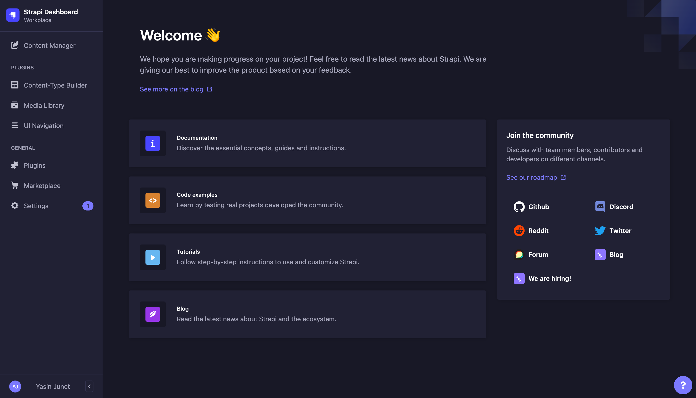

# How to add item on available languages?

1. First, open the [Strapi URL](https://sea-turtle-app-33ffu.ondigitalocean.app/admin) and login using **Super Admin** roles.
   

2. If login successful, then Strapi dashboard page will appear.
   

3. In the side panel menus, click **Content Manager** menu.
   

4. In the **Collection Types**, click **Available Languages**.
   

5. List of **Available Languages** will appear, then click **Create new entry** button at the top right screen.
   

6. Fill all the required fields. Please make sure the `language` field must be unique.
   

7. Click **Save** button at the top right screen, wait until success notification appear.
   

8. Don't forget to click **Publish** button to publish the page.
   

9. After **Publish** button has been clicked, Strapi will send webhooks to Netlify to re-build the code using updated data, this process takes time about 5 minutes less/more.

10. Access the new page via `https://q6a-website-dev.netlify.app/page/<slug>`. Example: if you fill the `slug` name with `about`, then the new page will be `https://q6a-website-dev.netlify.app/page/about`.

## Notes

- `language` field must be unique.
