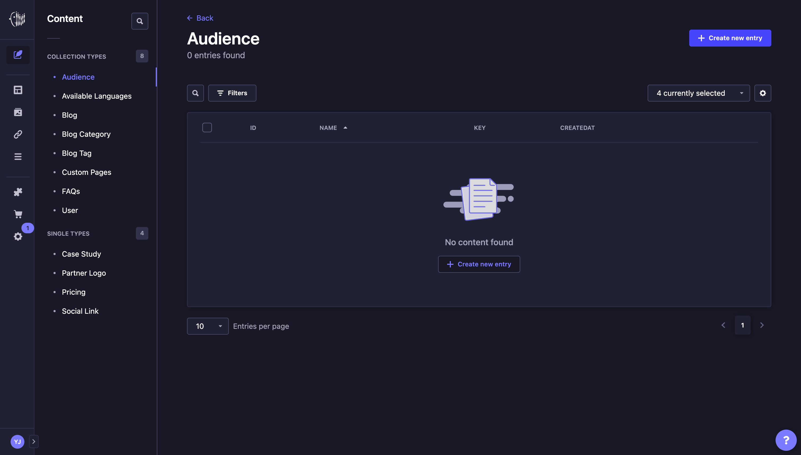
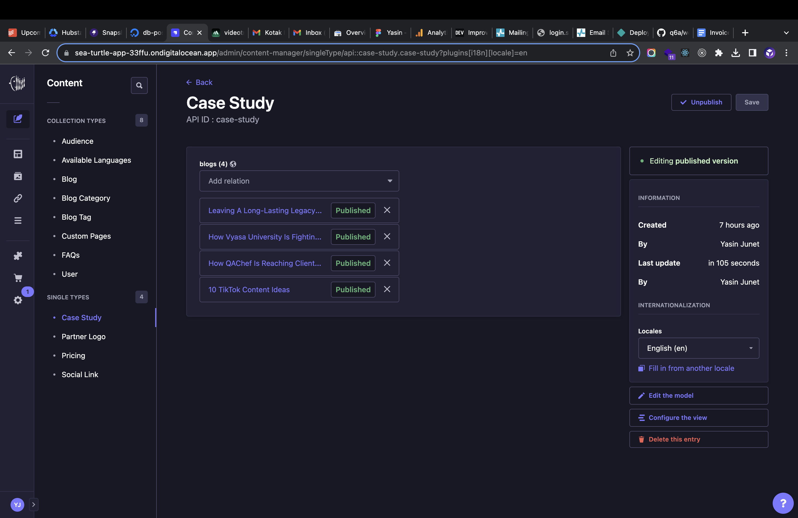
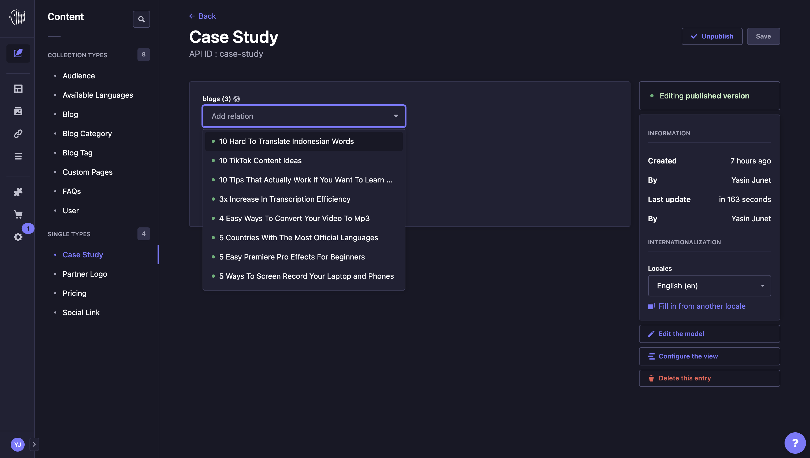
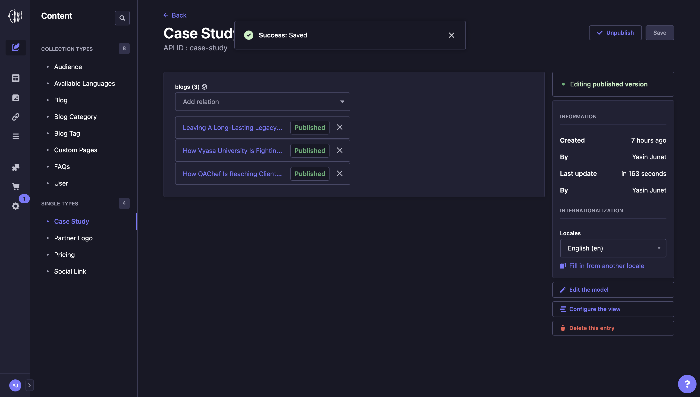

# How to modify case studies?

1. First, open the [Strapi URL](https://sea-turtle-app-33ffu.ondigitalocean.app/admin) and login using **Super Admin** roles.
   

2. If login successful, then Strapi dashboard page will appear.
   

3. In the side panel menus, click **Content Manager** menu.
   

4. In the **Collection Types Menu**, click **Case Study** under **Single Types**.
   

5. **Case study** will appear, then fill with the desired blog post.
   

6. Click **Save** button at the top right screen, wait until success notification appear.
   

7. Strapi will send webhooks to Netlify to re-build the code using updated data, this process takes time about 5 minutes less/more.

## Notes

- Don't forget to fill case studies for other languages.
