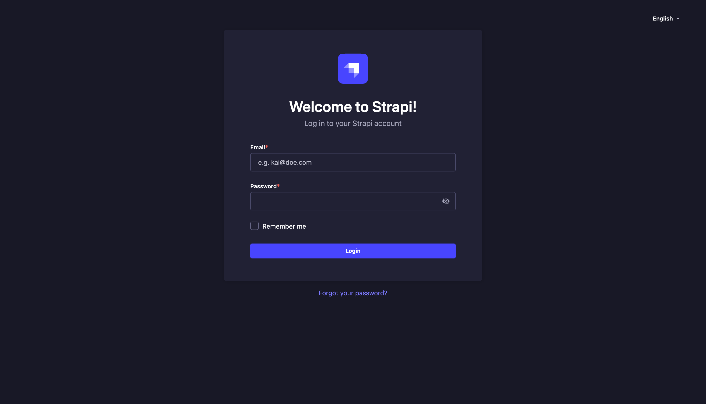
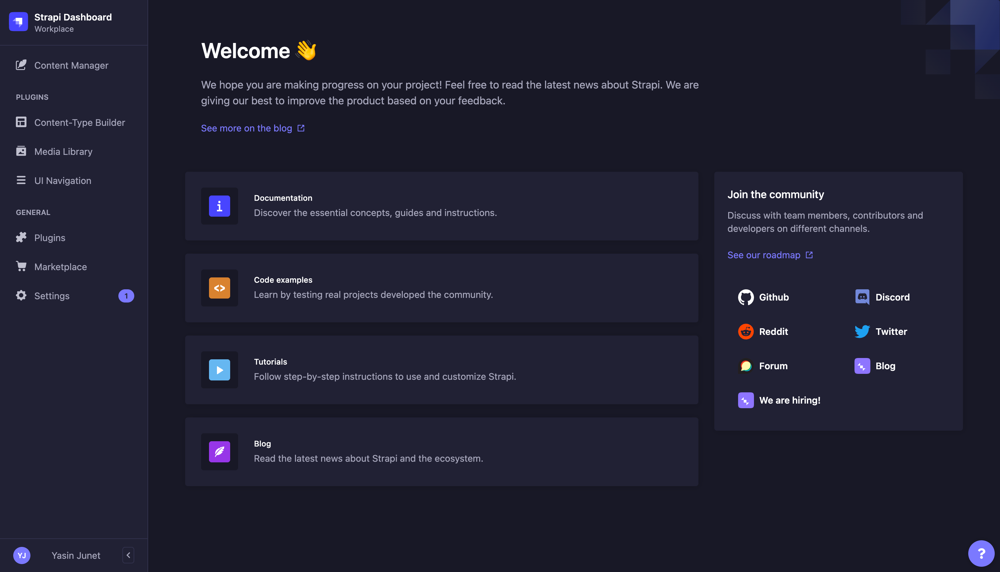
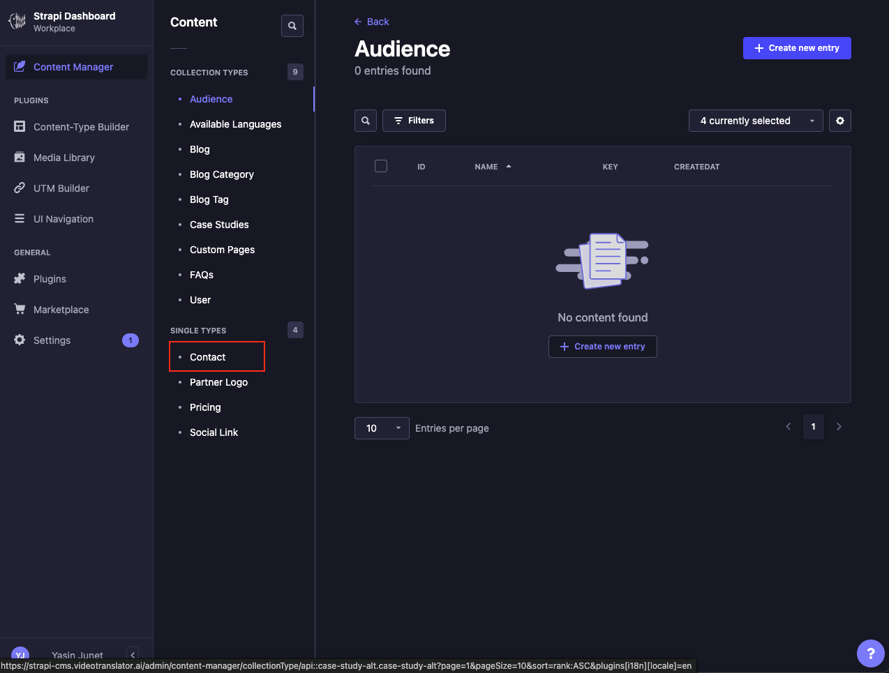
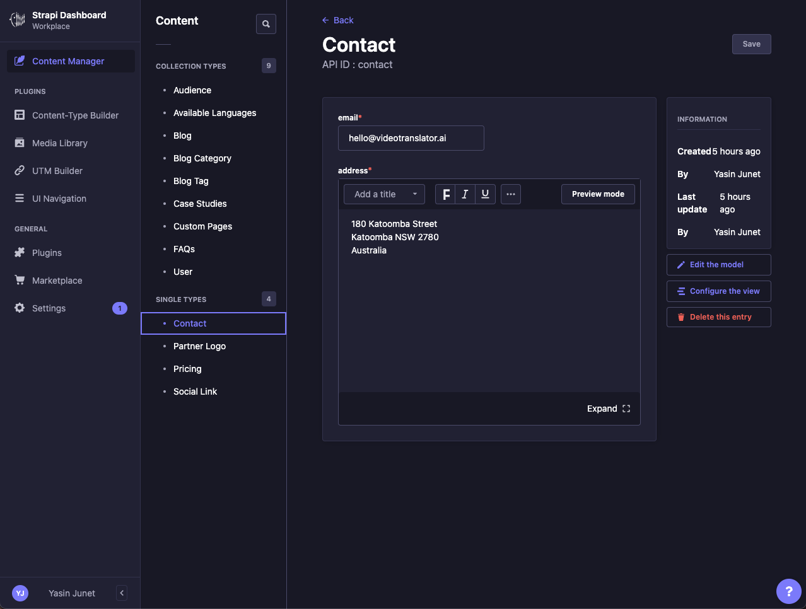

# How to modify contact info links?

1. First, open the [Strapi URL](https://sea-turtle-app-33ffu.ondigitalocean.app/admin) and login using **Super Admin** roles.
   

2. If login successful, then Strapi dashboard page will appear.
   

3. In the side panel menus, click **Content Manager** menu.
   

4. In the **Collection Types**, click **Contact** under **Single Types**.
   

5. **Contact Info** will appear, then fill the email and company address.

6. Click **Save** button at the top right screen, wait until success notification appear.

7. Strapi will send webhooks to Netlify to re-build the code using updated data, this process takes time about 5 minutes less/more.
