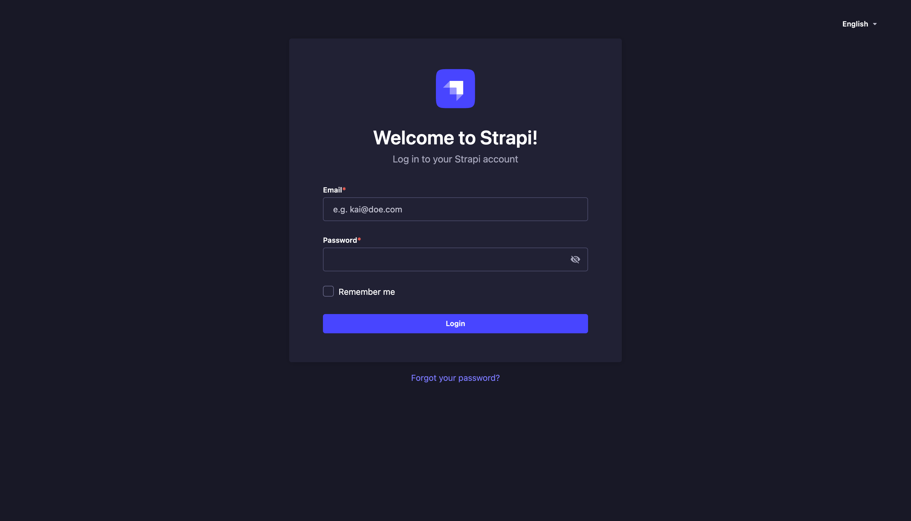

# How to modify header, and footer menus?

1. First, open the [Strapi URL](https://sea-turtle-app-33ffu.ondigitalocean.app/admin) and login using **Super Admin** roles.
   

2. If login successful, then Strapi dashboard page will appear.
   

3. In the side panel menus, click **UI Navigation** menu under plugins group.
   

4. Then click dropdown on the side of **Manage** button, then choose specific menu parts that you want to modify. See [notes](#notes) for menu parts references.
   

5. Click **New Item**.
   

6. Fill `Title` field with specific title of menu.
   

7. Set dropdown of `Navigation item type` to `Wrapper element`.
   

8. Set toggle `Attach to menu` to `TRUE` to create menu as a link, otherwise set to `FALSE`.
   

9. Fill `URL` field. Example: if you create a new custom page with slug name `about`, then fill this field with `page/about`.
   

10. Click **Save** button at the bottom left of popup to save new item, wait until success notification appear..
    

11. Click **Save** button at the top right screen, wait until success notification appear.
    

12. Strapi will send webhooks to Netlify to re-build the code using updated data, this process takes time about 5 minutes less/more.

## Notes

- Below the explanation of menu parts
  
- Menu order can configured by **dragging** icon below
  
- Parent with child menu only available on the **Header** menu parts
