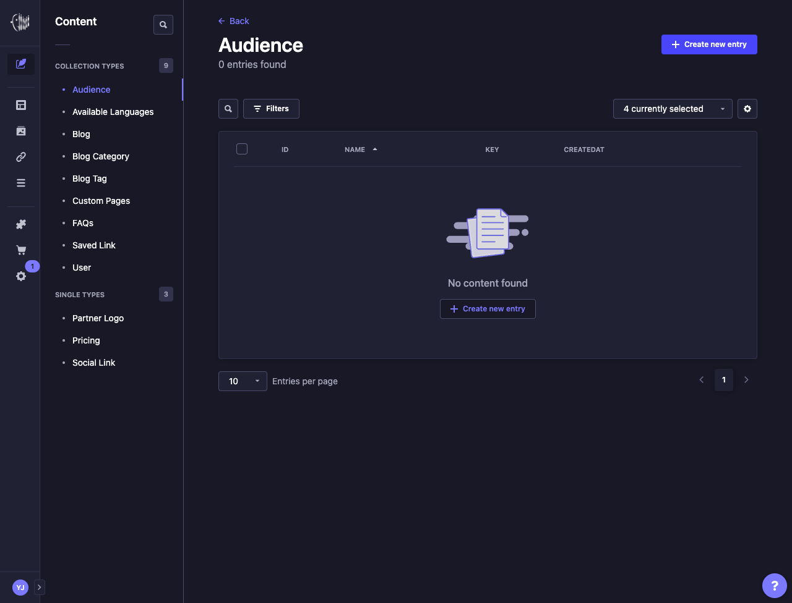
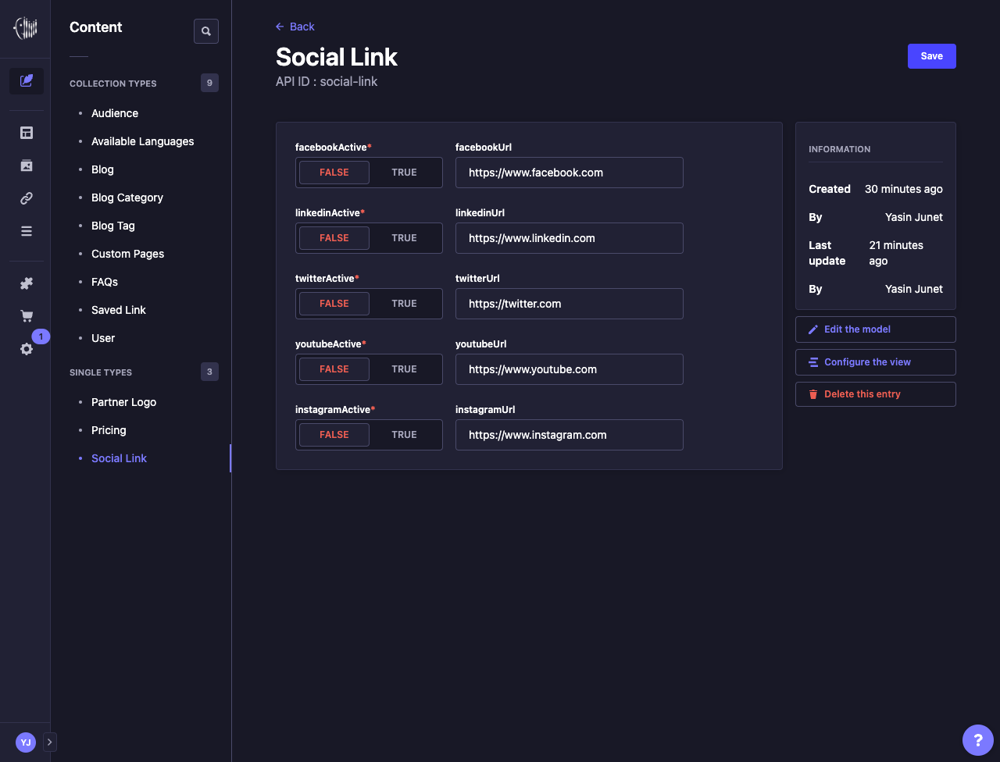
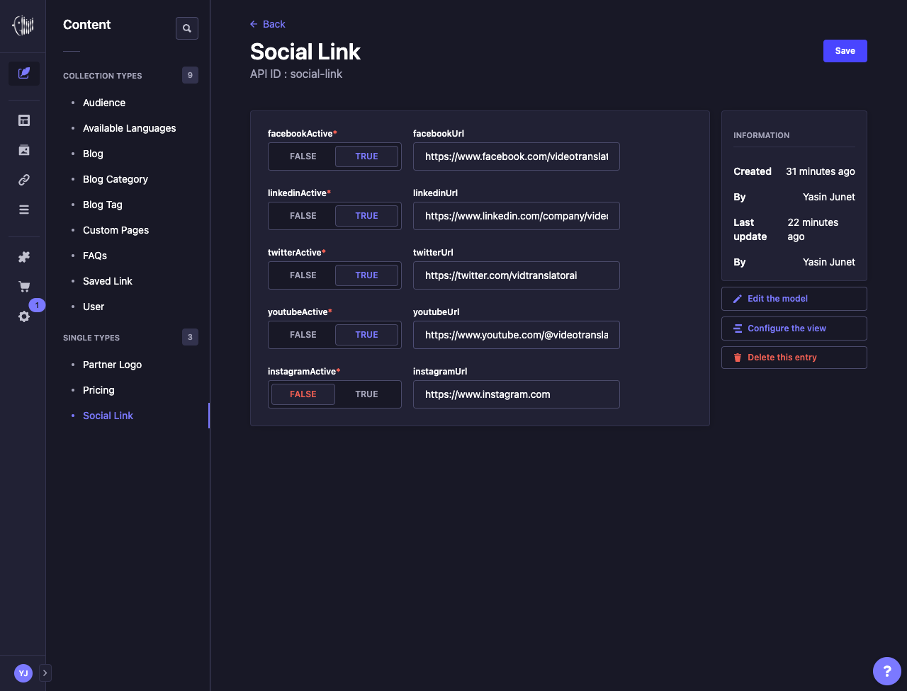
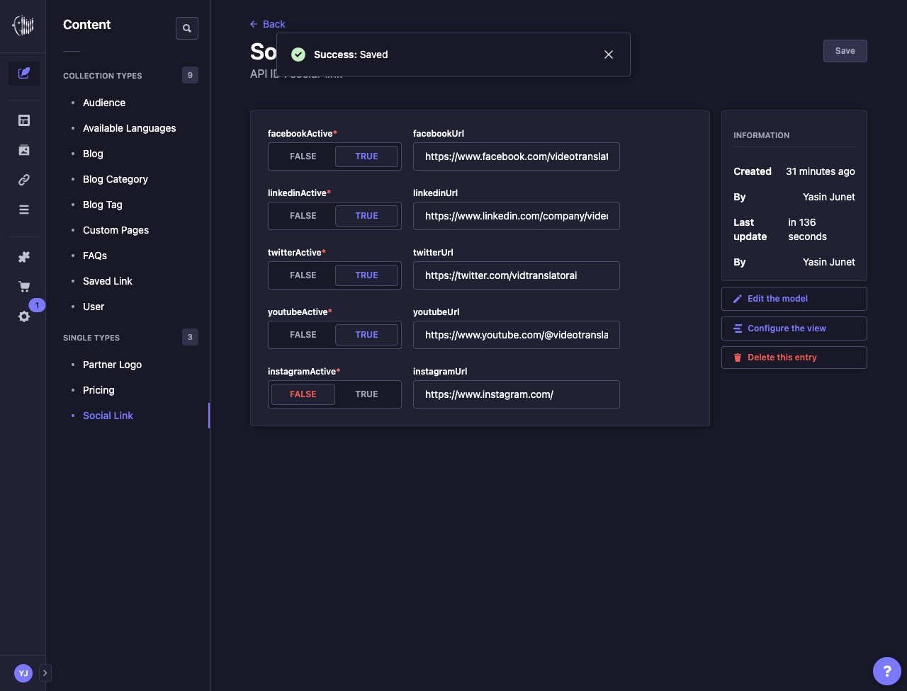

# How to modify social media links?

1. First, open the [Strapi URL](https://sea-turtle-app-33ffu.ondigitalocean.app/admin) and login using **Super Admin** roles.
   

2. If login successful, then Strapi dashboard page will appear.
   

3. In the side panel menus, click **Content Manager** menu.
   

4. In the **Collection Types**, click **Social Link** under **Single Types**.
   

5. **Social Link** will appear, then fill the active state of social media, and fill the social media URL field.
   

6. Click **Save** button at the top right screen, wait until success notification appear.
   

7. Strapi will send webhooks to Netlify to re-build the code using updated data, this process takes time about 5 minutes less/more.

## Notes

- Currently, there are only 5 social medias available (Facebook, LinkedIn, Twitter, Youtube, Instagram). Please let the developer knows if you need to add another social media.
